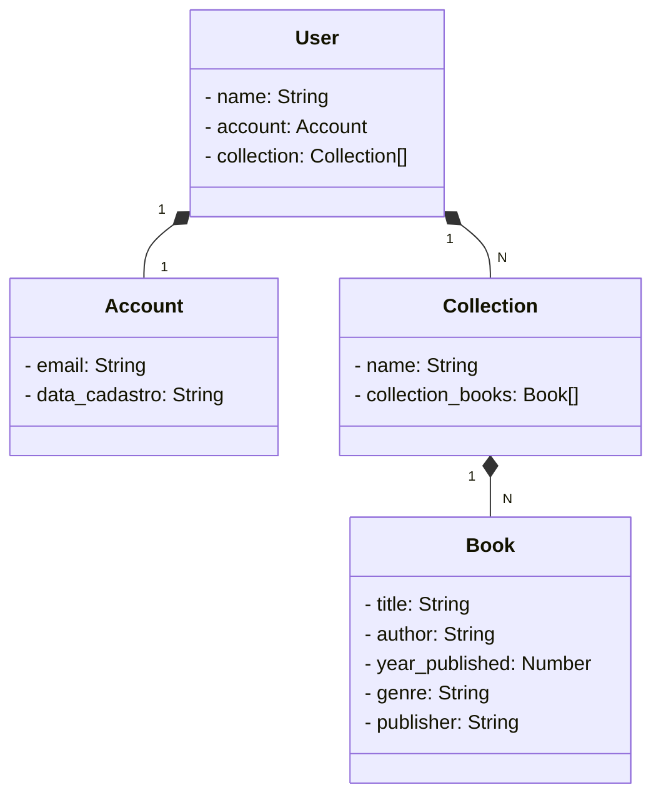

#Projeto BootCamp 2023
Java RESTful API criada para o bootcamp ANGULAR+JAVA da DIO.me

##Diagrama de Classes

```mermaid
classDiagram
  class User {
    - name: String
    - account: Account
    - collection: Collection[]
  }
  class Account {
    - email: String
    - data_cadastro: String
  }
  class Collection {
    - name: String
    - collection_books: Book[]
  }
  class Book {
    - title: String
    - author: String
    - year_published: Number
    - genre: String
    - publisher: String
  }

  User "1" *-- "1" Account
  User "1" *-- "N" Collection
  Collection "1" *-- "N" Book
```
